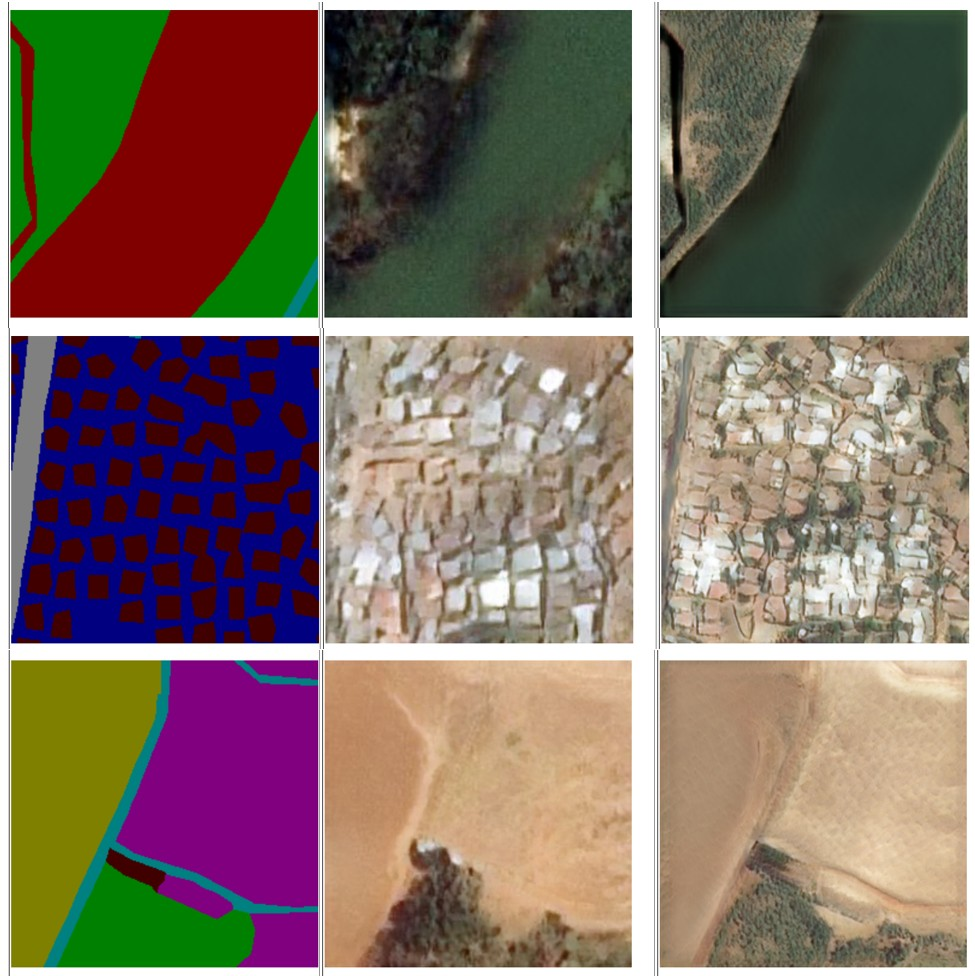

# Synthetic Satellite Imagery Generation using GANs

## Overview

This project provides a comprehensive guideline for utilizing Artificial Intelligence, specifically Generative Adversarial Networks (GANs), to produce synthetic high-resolution satellite imagery from vector maps. The workflow transforms vectorized Land Cover-Land Use data and additional geographic features represented as polygons into realistic satellite imagery.

## Key Features

- Generation of high-resolution synthetic satellite imagery
- Processing of vector maps with Land Cover-Land Use data
- Support for polygon-based geographic features
- Creation of imagery for locations without real reference data

## Background

This work is based on the methodology presented by Zhu & Kelly (2021). The primary distinction of this implementation is its focus on creating realistic synthetic imagery for locations that have no existing real-world reference, whereas the original work utilized reference imagery from existing places for enhancing purposes.

## Methodology

The project leverages Generative Adversarial Networks to learn the mapping between:
- **Input**: Vector-based Land Cover-Land Use maps and polygon features
- **Output**: Realistic high-resolution satellite imagery

## Citation

If you use this work, please cite:
- Zhu & Kelly (2021) [Original methodology]
- Lira-Mijares (2026) [Thesis project workflow]

## Contact

al448489@uji.es

## Acknowledgments

This project builds upon the foundational work of Zhu & Kelly (2021) in the field of synthetic satellite imagery generation.
